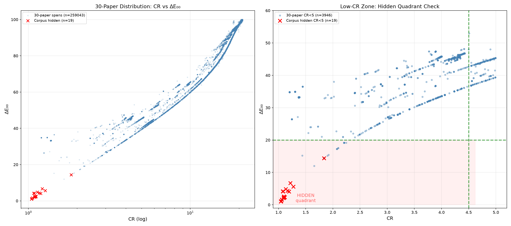
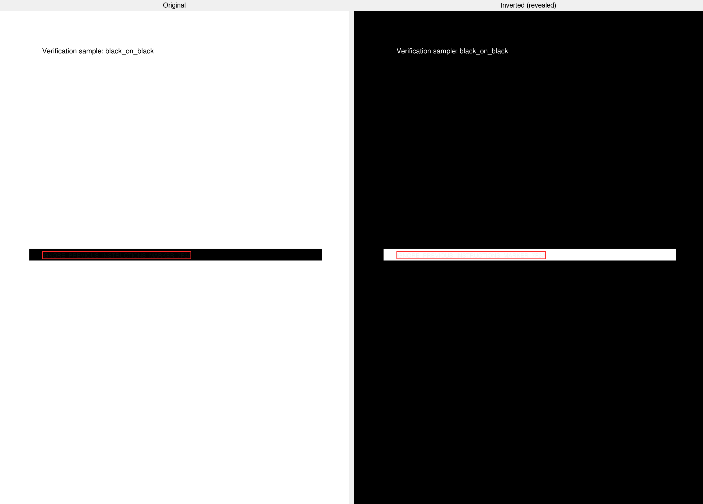

# RenderGuard

Detect hidden text in PDFs by measuring rendered pixels, not declared colors.
OCR-free, CPU-only detection at OCR-grade accuracy.

Prompt injection via invisible text is a real threat: white-on-white
instructions survive into LLM context when PDFs are parsed for RAG pipelines,
resume screening, or document review. Existing tools check declared font
colors against fixed thresholds — RenderGuard renders the page twice
(with and without text), diffs the pixels, and measures what the human eye
would actually see.


## Key Results

Corpus F1 and real-document FP rate are always presented together.
Neither metric stands alone.<sup>1</sup>

| Metric | Value | Scope |
|--------|-------|-------|
| **Corpus F1** | 1.000 | 31 samples<sup>2</sup> (25 hidden + 6 benign) |
| **Real-document FP rate** | 0.0077 % (20 / 259,043 spans) | 30 arXiv papers, 816 pages<sup>3</sup> |
| **PhantomLint FP rate** | 0.092 % (3 / 3,257 docs) | ICML 2025, per-document basis |
| **FP rate ratio** | 12× lower | per-span vs per-document — units differ; directional comparison |
| **Corpus speed** | 10.0 ms / sample | single-page synthetic PDFs |
| **Real-document speed** | 92.8 ms / page | 30 arXiv papers, CR-first gate enabled |
| **vs doc-sherlock** | 73× faster | corpus only (10.0 vs 729.9 ms); real-document comparison not measured |

- No OCR, no GPU, no ML model. Pure pixel measurement on CPU.
- Thresholds (CR < 3.0, ΔE₀₀ < 10.0) are derived from the gap between the
  hidden-corpus maximum and the nearest normal span in a 259,043-span
  distribution — not hand-picked constants. Hidden max ΔE₀₀ = 6.74, nearest
  normal span ΔE₀₀ = 12.03, gap = 5.29 units.

<sup>1</sup> F1 = 1.000 on a 31-sample corpus can overstate confidence without
real-document context. The 0.0077 % FP rate on 259k spans bounds the
false-alarm risk that F1 alone cannot capture.

<sup>2</sup> Full corpus: 33 samples = 27 hidden + 6 benign. Of the 27 hidden,
`tiny_font_0.5pt` and `offpage` are excluded (xfail) because they test
size-based and position-based hiding respectively — techniques outside
the color-matching model (see Limitations §3, §4). F1 is evaluated on
the remaining 25 hidden + 6 benign = 31 samples.

<sup>3</sup> Of the 20 FP spans: **(a)** 17 are TeX font encoding artifacts from a
single paper (2301.08362) — cmex10 maps delimiter char code 0xB8 to U+00FF
("ÿ") via a wrong ToUnicode CMap. The text layer extracts "ÿ" but the visual
render shows only anti-aliased edges of math symbols (pixel mean 254.8/255).
**(b)** 3 are thin-glyph measurement artifacts from other papers — normal text
with very thin strokes (hyphens, periods, math fragments) that produce < 5
glyph pixels at 150 DPI. The render-diff detects only anti-aliased edge
residue, yielding near-background CR/ΔE values.



*Left: full distribution (log-scale CR vs ΔE₀₀). Right: low-CR quadrant
zoom. Red ✕ = corpus hidden samples, clustered at bottom-left. Blue dots =
real-document spans. The hidden cluster is isolated from normal text by a
clear gap on both axes.*


## Why This Exists

### Absolute-color detectors miss non-white backgrounds

Two open-source scanners
([pdf-injection-scanner](https://github.com/Andy8647/pdf-injection-scanner),
[PDF-Prompt-Injection-Toolkit](https://github.com/zhihuiyuze/PDF-Prompt-Injection-Toolkit))
check whether each character's RGB exceeds a fixed threshold (e.g. > 0.9).
Both achieved **recall 45.5 %** (10 / 22 hidden samples) on our corpus.

They fail whenever the background is not white. The Pair C series demonstrates
this — every sample has CR = 1.10 (equally invisible), but tools that assume
a white background see progressively higher contrast as the background darkens:

| Sample | Foreground | Background | CR (true) | CR (vs white) | Overestimate | pis | toolkit |
|--------|-----------|-----------|-----------|---------------|--------------|-----|---------|
| pair_c0 | #F4F4F4 | #FFFFFF | 1.10 | 1.10 | 1.0× | TP | TP |
| pair_c1 | #EAEAEA | #F5F5F5 | 1.10 | 1.20 | 1.1× | TP | TP |
| pair_c2 | #D6D6D6 | #E0E0E0 | 1.10 | 1.45 | 1.3× | **FN** | **FN** |
| pair_c3 | #878787 | #808080 | 1.10 | 3.59 | 3.3× | **FN** | **FN** |
| pair_c4 | #464646 | #404040 | 1.10 | 9.44 | 8.6× | **FN** | **FN** |
| pair_c5 | #101010 | #000000 | 1.10 | 19.03 | **17.3×** | **FN** | **FN** |

All six are equally hidden (CR 1.10). From pair_c2 onward, the white-background
assumption inflates the apparent contrast ratio, and both tools classify them
as normal. At pair_c5 (black on black) the overestimate reaches **17×**.

Render-diff measures the actual rendered background, so CR is always 1.10
regardless of background color. All six are detected.

### doc-sherlock's contrast detector has never worked

[Doc-Sherlock](https://github.com/robomotic/doc-sherlock) includes a
`ContrastDetector` that calls `page.extract_words(extra_attrs=["fill"])`.
`"fill"` is not a valid pdfplumber attribute. The call raises an exception,
caught by a bare `except:`, and falls back to extraction without color data.

Result: **zero contrast findings on every input**, including pure
white-on-white text. This has been the case since the initial commit
(2025-04-17) — 15 months, 2 total commits, never corrected. The detector
is fail-open: it silently reports no issues rather than erroring out.

### Why two axes: the 322 green-link lesson

WCAG luminance contrast is blind to chroma. Hyperref's default green links
(`#00FF00` on white) have CR = 1.37 — below any reasonable hidden-text
threshold — yet are clearly visible.

During validation on 5 arXiv papers, **322 hyperref link spans** fell into
the low-CR zone. A single-axis CR threshold would flag all of them.

CIEDE2000 color distance (ΔE₀₀) captures the perceptual difference that
luminance misses:

| Span type | CR | ΔE₀₀ | Hidden? |
|-----------|-----|-------|---------|
| `#0A0A0A` on `#000000` | 1.06 | 1.6 | Yes |
| `#808080` on `#757575` | 1.17 | 4.3 | Yes |
| `#00FF00` on `#FFFFFF` | 1.37 | 33.3 | **No** (link) |

The two axes combined — CR < 3.0 **AND** ΔE₀₀ < 10.0 — catch all hidden text
while excluding all 322 green links. The gap between hidden max (ΔE₀₀ = 6.74)
and the nearest normal span (ΔE₀₀ = 12.03) is 5.29 units.


## How It Works

### Text-layer geometry + render-diff

The detector combines two independent sources: the PDF text layer
(which declares what text exists and where) and two rendered images
(which show what the human eye actually sees).

0. **Extract spans** from the text layer via `page.get_text("dict")`.
   Each span carries a bounding box and the text content — this is
   the ground truth for "what text is supposed to be on this page."
1. **Render** the page at 150 DPI → numpy RGB array (**with text**)
2. **Strip** all BT…ET text-drawing operators from the content stream
3. **Re-render** the same page → numpy RGB array (**without text**)
4. For each span's bbox, compute the **pixel difference** between the
   two renders = glyph mask (core pixels only, anti-aliasing excluded)
5. From the glyph mask, measure:
   - **CR**: WCAG sRGB luminance contrast ratio (glyph vs background)
   - **ΔE₀₀**: CIEDE2000 perceptual color distance

### Two-axis classification

```
HIDDEN if:
  glyph_px == 0                       → text layer has span, but render
                                        shows no stroke pixels (Tr=3,
                                        or fg ≡ bg within noise threshold)
  OR (CR < 3.0 AND ΔE₀₀ < 10.0)      → color-matched hiding

SUSPICIOUS if:
  CR < 4.5 AND ΔE₀₀ < 20.0           → near-threshold

NORMAL otherwise
```

`glyph_px == 0` is a detection signal, not a measurement failure.
The text layer declares the span exists; the render diff confirms no
visible stroke was produced. This mismatch catches invisible render
mode (Tr=3) and cases where foreground exactly matches background
(e.g. #FAFAFA on #FFFFFF — pixel diff falls below the noise floor).

### Visual verification

The dashboard renders original and color-inverted views side by side.
Hidden text that is invisible in the original becomes visible when
pixel values are inverted (255 − original):



*Left: original render — black text on black background, invisible to the
eye. Red bbox marks the detected hidden span. Right: inverted render —
the same text is now clearly readable.*


## Installation and Usage

### Requirements

- Python ≥ 3.10
- PyMuPDF (`pymupdf`), NumPy

```bash
pip install pymupdf numpy
```

### Core API

```python
from core import (
    scan_document, score_findings, evaluate,
    PolicyDecision,
)

findings, page_count, page_times = scan_document("document.pdf")
score_findings(findings)
result = evaluate(findings, page_count, page_times)

if result.decision == PolicyDecision.BLOCK:
    print(f"BLOCKED: {result.hidden_count} hidden span(s)")
    for f in result.findings:
        if f.verdict.value == "hidden":
            print(f"  p{f.page + 1}: {f.text[:30]}…")
else:
    print(f"PASS: {len(result.findings)} spans scanned, no threats")
```

### LangChain integration

```python
from integrators.langchain_loader import (
    SecureDocumentLoader,
    HiddenTextBlockedError,
)

try:
    docs = SecureDocumentLoader("report.pdf").load()
except HiddenTextBlockedError as e:
    print(f"Blocked: {e.scan_result.hidden_count} hidden spans")
```

Hidden spans are replaced with `[SANITIZED_HIDDEN_TEXT]` in the document
text. Scan metadata (decision, findings, scores) is attached to each
Document's `metadata` dict.

### Streamlit dashboard

```bash
pip install streamlit
streamlit run app/dashboard.py
```

Upload a PDF to see: decision banner, threat report table with masked
payloads, and side-by-side page visualizations with bbox overlays.


## Reproducing Benchmarks

### 1. Generate the test corpus

```bash
python tools/verification_harness/generate_corpus.py
```

Creates 33 synthetic PDFs in `corpus/` covering: color-matched hiding
(white-on-white through black-on-black), render mode 3, opacity,
blend modes, per-glyph gradients, and threshold evasion pairs.

### 2. Run baseline comparisons

```bash
python tools/verification_harness/run_baselines.py
```

Runs pdf-injection-scanner, doc-sherlock, and PDF-Prompt-Injection-Toolkit
against the corpus. Outputs `results/baseline_matrix.csv`.

### 3. Measure the 30-paper distribution

```bash
python tools/measure_distribution.py
```

Scans 30 arXiv papers (IDs listed in `data/arxiv_30/`), produces
the CR × ΔE₀₀ scatter plot and quadrant analysis used for threshold
derivation.

### 4. Timing benchmark

```bash
python tools/benchmark_timing.py
```

Measures per-page latency with and without the CR-first ΔE₀₀ gate.


## Limitations

Six techniques are out of scope for the current detector. Each is
documented with rationale and the approach that would be needed.

### 1. ToUnicode Spoofing

A custom font maps payload text to visually normal glyphs via a falsified
ToUnicode CMap. The rendered text looks legitimate; only the text extraction
layer carries the payload. CR and ΔE measure visual contrast — if the visual
render is normal, both metrics are high. **Needed:** OCR-vs-text-layer
comparison.

### 2. Font Encoding Artifacts

TeX math extension fonts (cmex10) map delimiter char codes to wrong Unicode
codepoints. The text layer extracts "ÿ"/"ř"; the visual render shows a math
symbol or nothing. Not an intentional attack. Currently counted as FP
(17 of 20 total FP spans). **Needed:** Font encoding validation or
glyph-name → Unicode cross-check.

### 3. Tiny Font Hiding (< 0.5 pt)

Text at extremely small font sizes produces fewer than 5 glyph pixels at
150 DPI, falling below the noise filter. This is a size-based technique,
orthogonal to the color-matching model. **Needed:** Minimum font-size check
on the text extraction layer.

### 4. Off-Page Text

Text placed outside the visible page boundary (negative coordinates or beyond
MediaBox) is never rendered, so render-diff produces no signal. **Needed:**
Bbox-vs-MediaBox boundary check on the text extraction layer.

### 5. Tr=3 Scan / OCR Layer Ambiguity

PDF text rendering mode 3 (invisible) is used both by OCR tools for
accessibility and by attackers for injection. The detector reports Tr=3 spans
as `invisible_render_mode` and the policy flags them, but distinguishing
benign OCR from attack requires structural heuristics (GlyphLessFont, image
XObject presence). **Needed:** Structural signal analysis.

### 6. DPI Sensitivity

The detector requires ≥ 150 DPI for reliable glyph pixel detection. Lower DPI
may cause thin strokes to fall below the noise threshold. 150 DPI is the
validated default; lower values have not been tested.

Full details: `docs/LIMITATIONS.md`.


## License

Code: MIT

Test corpus (`corpus/`): MIT — synthetic single-page PDFs generated by
`generate_corpus.py`.

arXiv papers: not included in this repository. Paper IDs are listed in
`data/arxiv_30/` for reproducibility; download them directly from arXiv
under their respective licenses.
